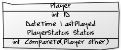

## Hangman Extreme - Player Ranking

To get a handle on the game's success we want to rank the players.  We are going to test the function that compares two players so that we can sort them.  We will use the standard ``IComparable<T>`` interface that returns -1, 0, or +1 to indicate less than/equal/greater than.

<!--
https://yuml.me/diagram/scruffy/class/draw

[Player|int ID;DateTime LastPlayed; PlayerStatus Status;|int CompareTo(Player other)]
-->

The rules for ranking the players are simple but have combinatorial effects:

1. If the Player ID is the same, then it's the same player.
1. The Player with the higher Status comes first.
1. If they have the same Status, then the Player that played most recently comes first.
1. Otherwise the Player with the lower ID comes first.

Get the code: 

    git clone https://github.com/pete-the-programmer/tdd-ex-micro2

__Your mission__: Check that the comparison function does what it says on the tin.
